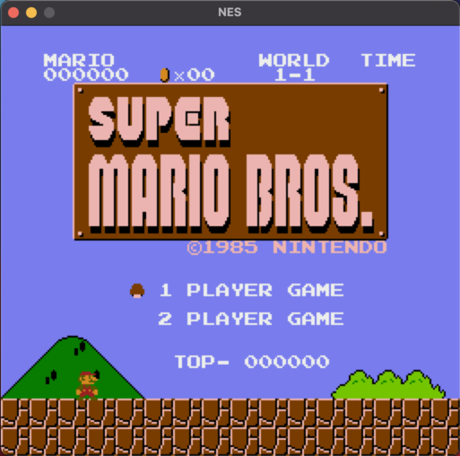

# NES
Need [SDL](https://www.libsdl.org/) in order to compile.

Player1 controlls:
- a - select
- s - start
- z - B
- x - A
- Arrow Keys: left, right, up, down

Player2 controlls (need to connect gamepad):
- A: A
- B: B
- DPAD: left, right, up, down

Controller mappings used [SDL_GameControllerDB](https://github.com/gabomdq/SDL_GameControllerDB)

Mappers implemented:
- 000

Games Tested:
- Super Mario Bros.
